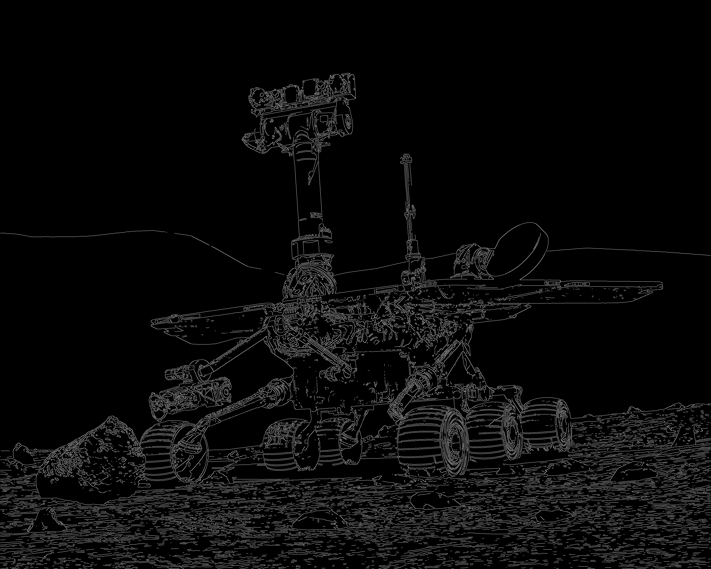

# 🖥️ CUDA Box Filter and Canny Edge Detector

Box Filter and Canny Edge Detector filters developed in CUDA as part of an university project developed for the 'Graphic Processors and Real Time Applications' course, part of the Master's Degree in 'Computer Graphics, Games and Virtual Reality' at Rey Juan Carlos University (URJC).
The project skeleton was provided by the course professor, where I had to implement all the kernels, memory management and the structure of the Canny Edge Detector, on the `func.cu` file.

## 🚀 Features

This project implements various image filtering algorithms using highly-parallelized CUDA kernels.

### 1. Convolution filters and necessary kernels
* **Box Filter & Gaussian Blur:** Implemented using standard 2D convolution stencil patterns where threads access neighboring pixel layouts. Edge cases are handled via boundary clamping.
* **RGB Channel Separation:** `Map` kernel that handles color channel isolation in parallel.
* **Alternative Filters:** Supports horizontal/vertical Sobel edge detection, image sharpening (3x3, 5x5), and 3x3 smoothing filters.
  
<table>
  <tr>
    <td align="center">
      <b>Laplacian Filter Output</b><br />
      
    </td>
    <td align="center">
      <b>Blur Output</b><br />
      
    </td>
  </tr>
</table>
  
### 2. Canny Edge Detector
The Canny pipeline is fully parallelized across multiple sequential CUDA kernels:
1. **Luminance Conversion (`map` kernel):** Transforms RGB data into Grayscale using the formula:  
   $$Y = 0.2126R + 0.7152G + 0.0722B$$
2. **Noise Reduction (`stencil` kernel):** Applies a 5x5 Gaussian Blur.
3. **Gradient Calculation (`map` kernel):** Computes horizontal ($K_x$) and vertical ($K_y$) Sobel derivatives to yield gradient magnitude and direction.
4. **Non-Maximum Suppression (`gather` kernel):** Thins the thick edges by checking pixel neighbors along the gradient vector direction, suppressing non-peak values to 0.
5. **Double Thresholding & Hysteresis (`reduction` & `gather` kernels):** Executes a global maximum reduction loop to determine dynamic bounds. Classifies pixels into *strong*, *weak*, and *non-edges*, transforming weak pixels into strong edges if they are connected to an existing strong neighbor.

  
<table>
  <tr>
    <td align="center">
      <b>Canny Edge Detector Output</b><br />
      
    </td>
  </tr>
</table>

## ⚡ Memory Optimizations

To reduce the typical 400-800 cycle latency of VRAM (Global Memory), the project incorporates two structural optimizations:

* **Constant Memory (`__constant__`):** The fixed convolution filter coefficients are moved to Constant Memory via `cudaMemcpyToSymbol`. This benefits from the hardware constant cache.
* **Shared Memory (`__shared__`):** Reduces redundant VRAM fetches. For instance, in a 9x9 filter with a 1024-thread block, global memory requires up to **82,944 read requests**. By staging the filter bounds into fast SRAM shared memory using the first 81 threads and syncing via `__syncthreads()`, global VRAM queries drop to just **81**.

## 🛠️ Build
* **Windows:** Visual Studio Solution (`.sln`).
* **Linux / macOS:** `CMakeLists.txt` files for easy building.

To use, define the input, filter ID, and output file on the command arguments. 
```
#Example with laplacian convolution filter (ID = 0)
Input/mars_rover.jpg 0 Output/laplacian.png
```

To change between memory types and convolution filters or canny edge detector use the #DEFINE brackets at the top of `func.cu`file.

